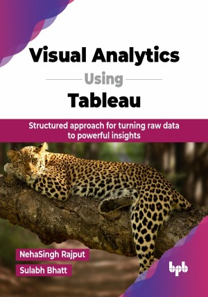

# Visual Analytics Using Tableau

Structured approach for turning raw data to powerful insights.

This is the repository for [Visual Analytics Using Tableau
](https://bpbonline.com/products/visual-analytics-using-tableau?variant=44270760689864),published by BPB Publications.

## About the Book
Tableau is one of the leading business intelligence and data visualization tools that fulfill almost all the requirements for getting insights from huge data and solving complex business queries using simple and complex visualizations. This book covers all the features supported by Tableau, from basics to advanced.

Master data storytelling with Tableau by learning to connect, clean, and analyze data from various sources. This book covers essential chart types like bar, line, and pie charts while introducing advanced features like filters, LOD expressions, and dual-axis charts. Create interactive dashboards by combining visualizations, adding controls, and customizing designs to engage your audience. Use storytelling techniques to present insights effectively. With advanced visualizations like combo and Gantt charts, this guide equips you with the skills to communicate data clearly and make informed, data-driven decisions.

This book begins with very basic information that even a beginner can understand. Gradually, the book covers intermediate and advanced features of Tableau, so it can help readers of all levels become experts in Tableau.

## What You Will Learn
• Understand different types of data sources and how to connect them.

• Learn techniques for cleaning and preparing data for visualization.

• Perform calculations, aggregations, and level of detail (LOD) expressions.

• Create both, simple and advanced visualizations to present data.

• Design visually engaging dashboards and storyboards to answer business questions effectively.
